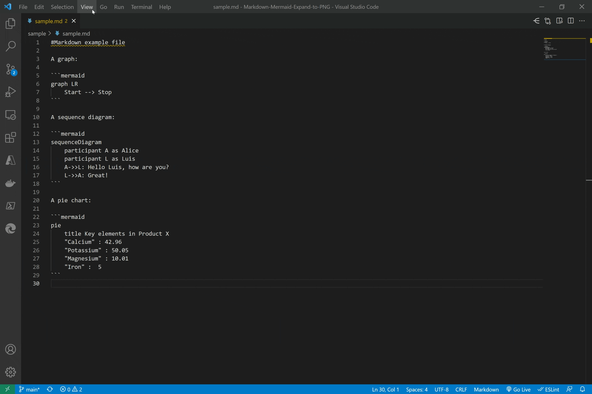
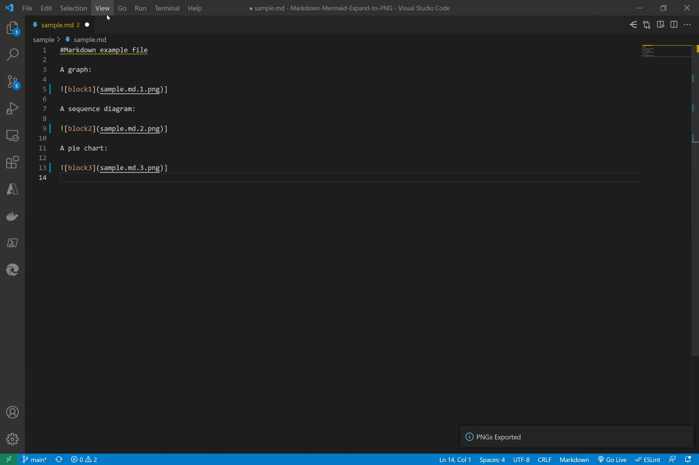

# Markdown-Mermaid-Expand-to-PNG

VS Code extension to expand your markdown mermaid tags to PNG and vice versa.

## Features

If you have a markdown file using mermaid and you want to publish it to sites that don't render mermaid you can use this extension.

This will allow you to transform all the mermaid tags to PNG.

It will also enable you to do the reverse and retrieve the original text from the PNGs back to the markdown file.

See it in action. Converting Markdown with Mermaid blocks to PNG:

Converting Markdown with PNGs back to Mermaid code:

You can test this with this [sample.md](https://raw.githubusercontent.com/luisalvesmartins/Markdown-Mermaid-Expand-to-PNG/main/sample/sample.md) file:

~~~markdown
#Markdown example file

A graph:

A sequence diagram:

A pie chart:

~~~

After executing the command "Convert Markdown code to PNG" it will be transformed to this file and 3 png files are created in the same folder:

~~~markdown
#Markdown example file

A graph:

]

A sequence diagram:

]

A pie chart:

]

~~~

Running the command "Convert Markdown Mermaid PNGs to Code" the file will be transformed to the original state.

> Note: If you edit the PNG files and not preserve the metadata, you'll lose the ability to revert to the original markdown file.

> Note: File newline delimeter must be CRLF

## Requirements

- JIMP for Image conversion - JPG to PNG

- Mermaid.ink for Mermaid source conversion to JPG

## Release Notes

### 1.3.0

Fix documentation

### 1.1.0

Initial release.

### Useful links

* [Mermaid](https://mermaid-js.github.io/)
* [VS Code extension](https://marketplace.visualstudio.com/items?itemName=LuisAlvesMartins.markdown-code-to-png)

### Note:
For the solution to run there is an http call to mermaid server (mermaid.ink).
