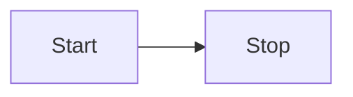
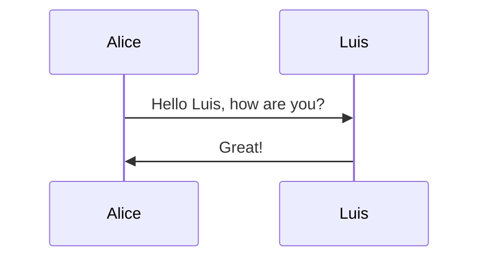
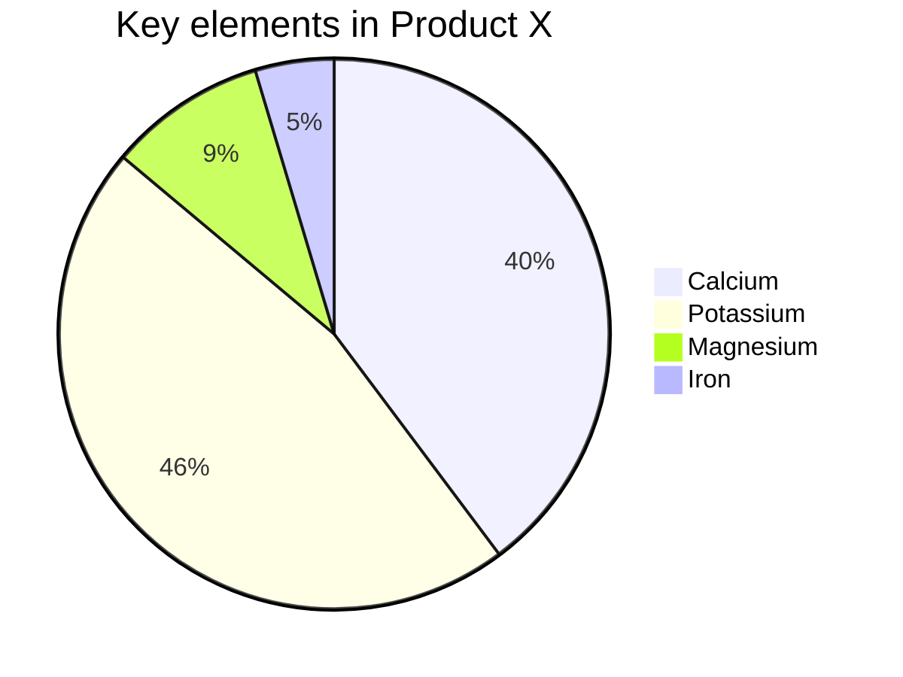

#Markdown example file

A graph:

```mermaid
graph LR
    Start --> Stop
```

A sequence diagram:

```mermaid
sequenceDiagram
    participant A as Alice
    participant L as Luis
    A->>L: Hello Luis, how are you?
    L->>A: Great!
```

A pie chart:

```mermaid
pie
    title Key elements in Product X
    "Calcium" : 42.96
    "Potassium" : 50.05
    "Magnesium" : 10.01
    "Iron" :  5
```
